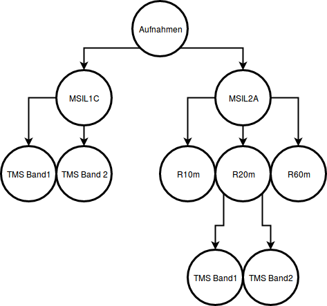
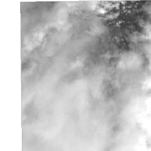
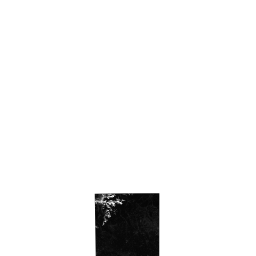
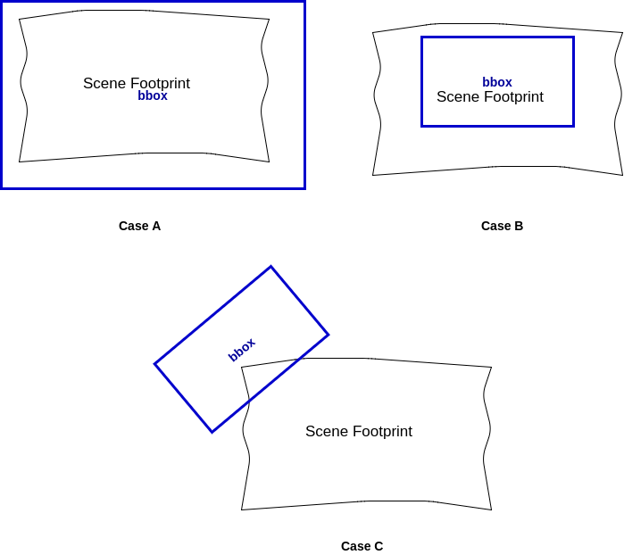

## Discovery

Die .io-Seite kann unter [https://amun-software.github.io/Geosoft2DiscoveryService/](https://amun-software.github.io/Geosoft2DiscoveryService/) eingesehen werden.

_Discovery_ ist eine Backend-Komponente in _SPHINX_.

Die folgenden Funktionalitäten werden von DISCOVERY zur Verfügung gestellt:
- Ein TMS für jeden Kanal einer Aufnahme
- Filterfunktionen für die Metadaten
    -  Scenennamen
    - BBOX
    - Min. Datum
    - Max. Datum
- ~~Abfragen von original Pixelwerten eines Farbkanals über Latitude und Longitude~~ (nicht mehr möglich)

Die Dokumentation beschreibt zunächst die Installation und das Interface des Servers. Anschließend wird die Vorverarbeitung der Sentinel-2 Daten beschrieben, damit diese in den Dienst eingebunden werden können.


## Installation und Starten
Nach dem Download des Projekts, im root-Verzeichnis (dort wo die package.json liegt) *npm install* ausführen.

Zum Starten des Servers wahlweise *npm start* oder *node index.js* ausführen.

## Lizensierung

## Tests ausführen mit
npm test

### TMS API
Für jeden Kanal einer Aufnahme wird ein eigener TMS zur Verfügung gestellt. Je nach angefragten Aufnahmetyp (MSIL1C, MSIL2A), unterscheiden sich die Endpunkte.


Es werden die Zoomstufen 0-14 unterstützt.

#### MSIL1C
**Get:** /img/datasetidentifier/IMG_DATA/band/Z/X/Y.png

 * datasetidentifier: MMM_MSIL1C_YYYYMMDDHHMMSS_Nxxyy_ROOOTxxxxx<Product Discriminator>.SAFE
 * band: B01, B02, B03, ... B12, BBA
 * Z/X/Y gemäß TMS Spezifikation 

**Antwort:**  256x256 tile in .png format

**Beispiel**
[http://gis-bigdata:11016/img/S2A_MSIL1C_20161212T082332_N0204_R121_T34KGD_20161212T084403.SAFE/IMG_DATA/B01/10/577/456.png](http://gis-bigdata:11016/img/S2A_MSIL1C_20161212T082332_N0204_R121_T34KGD_20161212T084403.SAFE/IMG_DATA/B01/10/577/456.png)



#### MSIL2A
**Get:** /img/datasetidentifier/IMG_DATA/resolution/band/Z/X/Y.png

 * datasetidentifier: MMM_MSIL2A_YYYYMMDDHHMMSS_Nxxyy_ROOOTxxxxx<Product Discriminator>.SAFE
 * resolution: R10m, R20m, R60m
 * bands: 
   * R10m: B02, B03, B04, B08, TCI, WVP, AOT
   * R20m: B02, ..., B07, B11, B12, BBA, AOT, SCL, TCI, VIS, WVP
   * R60m: B01, ..., B07, B09, B11, B12, BBA, AOT, SCL, TCI, WVP
 * Z/X/Y gemäß TMS Spezifikation

**Antwort:** 256x256 tile in .png format

**Beispiel:**

[http://gis-bigdata:11016/img/S2A_MSIL2A_20170805T102031_N0205_R065_T32TMR_20170805T102535.SAFE/IMG_DATA/R10m/B02/6/33/41.png](http://gis-bigdata:11016/img/S2A_MSIL2A_20170805T102031_N0205_R065_T32TMR_20170805T102535.SAFE/IMG_DATA/R10m/B02/6/33/41.png)



## Metadate filtering

### API
**Get:** /datasets

**Akzeptierte Abfrageparameter:**
 * identifiers: Leerzeichen separierte Liste von Suchbegriffen in Scenenbeschreibungen. Werden mit logischen UND verknüpft
 * bbox: Räumliche Ausdehnung der Aufnahme WGS84: minx,miny,maxx,maxy
 * minDateTime: Wie alt die jüngste Aufnahme sein darf (exklusive)
 * maxDateTime: Wie alt die älteste Aufnahme sein darf (exklusive)

**Antwort:**
Array von Scene-Objekten welche die Filterbedingungen erfüllen. Werden keine Filterbedingungen angegeben, werde die Metadaten aller verfügbaren Aufnahmen zurückgegeben. Die Parameter sind UND-Verknüpft.

**Beispiele**

***Suchen nach einer Aufname per identifier***

[http://gis-bigdata:11016/datasets?identifiers=20171010T104021](http://gis-bigdata:11016/datasets?identifiers=20171010T104021)

[http://gis-bigdata:11016/datasets?identifiers=2017 1010T 104 021](http://gis-bigdata:11016/datasets?identifiers=20171010T104021)


```json
[
    {
        "sceneName": "S2A_MSIL1C_20171010T104021_N0205_R008_T30PTB_20171010T104947.SAFE",
        "currentFilePath": "../sentinel2/S2A_MSIL1C_20171010T104021_N0205_R008_T30PTB_20171010T104947.SAFE",
        "MTD": {
            "description": "MTD_MSIL1C.xml",
            "driverShortName": "SENTINEL2",
            "driverLongName": "Sentinel 2",
            "files": [
                "MTD_MSIL1C.xml"
            ],
            "size": [
                512,
                512
            ],
            "coordinateSystem": {
                "wkt": ""
            },
            "metadata": {
                "": {
                    "CLOUD_COVERAGE_ASSESSMENT": "4.9866",
                    "DATATAKE_1_DATATAKE_SENSING_START": "2017-10-10T10:40:21.026Z",
                    "DATATAKE_1_DATATAKE_TYPE": "INS-NOBS",
                    "DATATAKE_1_ID": "GS2A_20171010T104021_012017_N02.05",
                    "DATATAKE_1_SENSING_ORBIT_DIRECTION": "DESCENDING",
                    "DATATAKE_1_SENSING_ORBIT_NUMBER": "8",
                    "DATATAKE_1_SPACECRAFT_NAME": "Sentinel-2A",
                    "DEGRADED_ANC_DATA_PERCENTAGE": "0",
                    "DEGRADED_MSI_DATA_PERCENTAGE": "0",
                    "FOOTPRINT": "POLYGON((-5.792574778325615 15.21306525473414, -5.77238811748588 15.30284082872241, -5.759542476122597 15.35996672719849, -4.772206157911985 15.37008837747189, -4.764121373097517 14.377826199225611, -5.781720811443401 14.368052294534657, -5.792574778325615 15.21306525473414))",
                    "FORMAT_CORRECTNESS_FLAG": "PASSED",
                    "GENERAL_QUALITY_FLAG": "PASSED",
                    "GENERATION_TIME": "2017-10-10T10:49:47.000000Z",
                    "GEOMETRIC_QUALITY_FLAG": "PASSED",
                    "PREVIEW_GEO_INFO": "Not applicable",
                    "PREVIEW_IMAGE_URL": "Not applicable",
                    "PROCESSING_BASELINE": "02.05",
                    "PROCESSING_LEVEL": "Level-1C",
                    "PRODUCT_START_TIME": "2017-10-10T10:40:21.026Z",
                    "PRODUCT_STOP_TIME": "2017-10-10T10:40:21.026Z",
                    "PRODUCT_TYPE": "S2MSI1C",
                    "PRODUCT_URI": "S2A_MSIL1C_20171010T104021_N0205_R008_T30PTB_20171010T104947.SAFE",
                    "QUANTIFICATION_VALUE": "10000",
                    "RADIOMETRIC_QUALITY_FLAG": "PASSED",
                    "REFERENCE_BAND": "B1",
                    "REFLECTANCE_CONVERSION_U": "1.00159547411106",
                    "SENSOR_QUALITY_FLAG": "PASSED",
                    "SPECIAL_VALUE_NODATA": "0",
                    "SPECIAL_VALUE_SATURATED": "65535"
                },
                "SUBDATASETS": {
                    "SUBDATASET_1_NAME": "SENTINEL2_L1C:MTD_MSIL1C.xml:10m:EPSG_32630",
                    "SUBDATASET_1_DESC": "Bands B2, B3, B4, B8 with 10m resolution, UTM 30N",
                    "SUBDATASET_2_NAME": "SENTINEL2_L1C:MTD_MSIL1C.xml:20m:EPSG_32630",
                    "SUBDATASET_2_DESC": "Bands B5, B6, B7, B8A, B11, B12 with 20m resolution, UTM 30N",
                    "SUBDATASET_3_NAME": "SENTINEL2_L1C:MTD_MSIL1C.xml:60m:EPSG_32630",
                    "SUBDATASET_3_DESC": "Bands B1, B9, B10 with 60m resolution, UTM 30N",
                    "SUBDATASET_4_NAME": "SENTINEL2_L1C:MTD_MSIL1C.xml:TCI:EPSG_32630",
                    "SUBDATASET_4_DESC": "True color image, UTM 30N"
                }
            },
            "cornerCoordinates": {
                "upperLeft": [
                    0,
                    0
                ],
                "lowerLeft": [
                    0,
                    512
                ],
                "lowerRight": [
                    512,
                    512
                ],
                "upperRight": [
                    512,
                    0
                ],
                "center": [
                    256,
                    256
                ]
            },
            "wgs84Extent": {
                "type": "Polygon",
                "coordinates": [
                    []
                ]
            },
            "bands": []
        },
        "availableBands": [
            "B01",
            "B02",
            "B03",
            "B04",
            "B05",
            "B06",
            "B07",
            "B08",
            "B09",
            "B10",
            "B11",
            "B12",
            "B8A",
            "TCI"
        ],
        "tmsUrls": {
            "B01": "http://gis-bigdata:11016/img/S2A_MSIL1C_20171010T104021_N0205_R008_T30PTB_20171010T104947.SAFE/IMG_DATA/B01",
            "B02": "http://gis-bigdata:11016/img/S2A_MSIL1C_20171010T104021_N0205_R008_T30PTB_20171010T104947.SAFE/IMG_DATA/B02",
            "B03": "http://gis-bigdata:11016/img/S2A_MSIL1C_20171010T104021_N0205_R008_T30PTB_20171010T104947.SAFE/IMG_DATA/B03",
            "B04": "http://gis-bigdata:11016/img/S2A_MSIL1C_20171010T104021_N0205_R008_T30PTB_20171010T104947.SAFE/IMG_DATA/B04",
            "B05": "http://gis-bigdata:11016/img/S2A_MSIL1C_20171010T104021_N0205_R008_T30PTB_20171010T104947.SAFE/IMG_DATA/B05",
            "B06": "http://gis-bigdata:11016/img/S2A_MSIL1C_20171010T104021_N0205_R008_T30PTB_20171010T104947.SAFE/IMG_DATA/B06",
            "B07": "http://gis-bigdata:11016/img/S2A_MSIL1C_20171010T104021_N0205_R008_T30PTB_20171010T104947.SAFE/IMG_DATA/B07",
            "B08": "http://gis-bigdata:11016/img/S2A_MSIL1C_20171010T104021_N0205_R008_T30PTB_20171010T104947.SAFE/IMG_DATA/B08",
            "B09": "http://gis-bigdata:11016/img/S2A_MSIL1C_20171010T104021_N0205_R008_T30PTB_20171010T104947.SAFE/IMG_DATA/B09",
            "B10": "http://gis-bigdata:11016/img/S2A_MSIL1C_20171010T104021_N0205_R008_T30PTB_20171010T104947.SAFE/IMG_DATA/B10",
            "B11": "http://gis-bigdata:11016/img/S2A_MSIL1C_20171010T104021_N0205_R008_T30PTB_20171010T104947.SAFE/IMG_DATA/B11",
            "B12": "http://gis-bigdata:11016/img/S2A_MSIL1C_20171010T104021_N0205_R008_T30PTB_20171010T104947.SAFE/IMG_DATA/B12",
            "B8A": "http://gis-bigdata:11016/img/S2A_MSIL1C_20171010T104021_N0205_R008_T30PTB_20171010T104947.SAFE/IMG_DATA/B8A",
            "TCI": "http://gis-bigdata:11016/img/S2A_MSIL1C_20171010T104021_N0205_R008_T30PTB_20171010T104947.SAFE/IMG_DATA/TCI"
        }
    }
]
```

**Beispiele**

***Suchen per Datumsfilter und bbox***

[http://gis-bigdata:11016/datasets?identifiers=2017&bbox=-5.231,14.9295,-5.231,2014.9295](http://gis-bigdata:11016/datasets?identifiers=2017&bbox=-5.231,14.9295,-5.231,2014.9295)

```json
[
   {
      "sceneName":"S2A_MSIL1C_20171010T104021_N0205_R008_T30PTB_20171010T104947.SAFE",
      "currentFilePath":"./../sentinel2_0_8500Backup/S2A_MSIL1C_20171010T104021_N0205_R008_T30PTB_20171010T104947.SAFE",
      "MTD":{
         "description":"MTD_MSIL1C.xml",
         "driverShortName":"SENTINEL2",
         "driverLongName":"Sentinel 2",
         "files":[
            "MTD_MSIL1C.xml"
         ],
         "size":[
            512,
            512
         ],
         "coordinateSystem":{
            "wkt":""
         },
         "metadata":{
            "":{
               "CLOUD_COVERAGE_ASSESSMENT":"4.9866",
               "DATATAKE_1_DATATAKE_SENSING_START":"2017-10-10T10:40:21.026Z",
               "DATATAKE_1_DATATAKE_TYPE":"INS-NOBS",
               "DATATAKE_1_ID":"GS2A_20171010T104021_012017_N02.05",
               "DATATAKE_1_SENSING_ORBIT_DIRECTION":"DESCENDING",
               "DATATAKE_1_SENSING_ORBIT_NUMBER":"8",
               "DATATAKE_1_SPACECRAFT_NAME":"Sentinel-2A",
               "DEGRADED_ANC_DATA_PERCENTAGE":"0",
               "DEGRADED_MSI_DATA_PERCENTAGE":"0",
               "FOOTPRINT":"POLYGON((-5.792574778325615 15.21306525473414, -5.77238811748588 15.30284082872241, -5.759542476122597 15.35996672719849, -4.772206157911985 15.37008837747189, -4.764121373097517 14.377826199225611, -5.781720811443401 14.368052294534657, -5.792574778325615 15.21306525473414))",
               "FORMAT_CORRECTNESS_FLAG":"PASSED",
               "GENERAL_QUALITY_FLAG":"PASSED",
               "GENERATION_TIME":"2017-10-10T10:49:47.000000Z",
               "GEOMETRIC_QUALITY_FLAG":"PASSED",
               "PREVIEW_GEO_INFO":"Not applicable",
               "PREVIEW_IMAGE_URL":"Not applicable",
               "PROCESSING_BASELINE":"02.05",
               "PROCESSING_LEVEL":"Level-1C",
               "PRODUCT_START_TIME":"2017-10-10T10:40:21.026Z",
               "PRODUCT_STOP_TIME":"2017-10-10T10:40:21.026Z",
               "PRODUCT_TYPE":"S2MSI1C",
               "PRODUCT_URI":"S2A_MSIL1C_20171010T104021_N0205_R008_T30PTB_20171010T104947.SAFE",
               "QUANTIFICATION_VALUE":"10000",
               "RADIOMETRIC_QUALITY_FLAG":"PASSED",
               "REFERENCE_BAND":"B1",
               "REFLECTANCE_CONVERSION_U":"1.00159547411106",
               "SENSOR_QUALITY_FLAG":"PASSED",
               "SPECIAL_VALUE_NODATA":"0",
               "SPECIAL_VALUE_SATURATED":"65535"
            },
            "SUBDATASETS":{
               "SUBDATASET_1_NAME":"SENTINEL2_L1C:MTD_MSIL1C.xml:10m:EPSG_32630",
               "SUBDATASET_1_DESC":"Bands B2, B3, B4, B8 with 10m resolution, UTM 30N",
               "SUBDATASET_2_NAME":"SENTINEL2_L1C:MTD_MSIL1C.xml:20m:EPSG_32630",
               "SUBDATASET_2_DESC":"Bands B5, B6, B7, B8A, B11, B12 with 20m resolution, UTM 30N",
               "SUBDATASET_3_NAME":"SENTINEL2_L1C:MTD_MSIL1C.xml:60m:EPSG_32630",
               "SUBDATASET_3_DESC":"Bands B1, B9, B10 with 60m resolution, UTM 30N",
               "SUBDATASET_4_NAME":"SENTINEL2_L1C:MTD_MSIL1C.xml:TCI:EPSG_32630",
               "SUBDATASET_4_DESC":"True color image, UTM 30N"
            }
         },
         "cornerCoordinates":{
            "upperLeft":[
               0,
               0
            ],
            "lowerLeft":[
               0,
               512
            ],
            "lowerRight":[
               512,
               512
            ],
            "upperRight":[
               512,
               0
            ],
            "center":[
               256,
               256
            ]
         },
         "wgs84Extent":{
            "type":"Polygon",
            "coordinates":[
               [

               ]
            ]
         },
         "bands":[

         ]
      },
      "availableBands":[
         "B01",
         "B02",
         "B03",
         "B04",
         "B05",
         "B06",
         "B07",
         "B08",
         "B09",
         "B10",
         "B11",
         "B12",
         "B8A"
      ],
      "tmsUrls":{
         "B01":"http://gis-bigdata:11016/img/S2A_MSIL1C_20171010T104021_N0205_R008_T30PTB_20171010T104947.SAFE/IMG_DATA/B01",
         "B02":"http://gis-bigdata:11016/img/S2A_MSIL1C_20171010T104021_N0205_R008_T30PTB_20171010T104947.SAFE/IMG_DATA/B02",
         "B03":"http://gis-bigdata:11016/img/S2A_MSIL1C_20171010T104021_N0205_R008_T30PTB_20171010T104947.SAFE/IMG_DATA/B03",
         "B04":"http://gis-bigdata:11016/img/S2A_MSIL1C_20171010T104021_N0205_R008_T30PTB_20171010T104947.SAFE/IMG_DATA/B04",
         "B05":"http://gis-bigdata:11016/img/S2A_MSIL1C_20171010T104021_N0205_R008_T30PTB_20171010T104947.SAFE/IMG_DATA/B05",
         "B06":"http://gis-bigdata:11016/img/S2A_MSIL1C_20171010T104021_N0205_R008_T30PTB_20171010T104947.SAFE/IMG_DATA/B06",
         "B07":"http://gis-bigdata:11016/img/S2A_MSIL1C_20171010T104021_N0205_R008_T30PTB_20171010T104947.SAFE/IMG_DATA/B07",
         "B08":"http://gis-bigdata:11016/img/S2A_MSIL1C_20171010T104021_N0205_R008_T30PTB_20171010T104947.SAFE/IMG_DATA/B08",
         "B09":"http://gis-bigdata:11016/img/S2A_MSIL1C_20171010T104021_N0205_R008_T30PTB_20171010T104947.SAFE/IMG_DATA/B09",
         "B10":"http://gis-bigdata:11016/img/S2A_MSIL1C_20171010T104021_N0205_R008_T30PTB_20171010T104947.SAFE/IMG_DATA/B10",
         "B11":"http://gis-bigdata:11016/img/S2A_MSIL1C_20171010T104021_N0205_R008_T30PTB_20171010T104947.SAFE/IMG_DATA/B11",
         "B12":"http://gis-bigdata:11016/img/S2A_MSIL1C_20171010T104021_N0205_R008_T30PTB_20171010T104947.SAFE/IMG_DATA/B12",
         "B8A":"http://gis-bigdata:11016/img/S2A_MSIL1C_20171010T104021_N0205_R008_T30PTB_20171010T104947.SAFE/IMG_DATA/B8A"
      }
   }
]
```


### Technische Details
In den vorverarbeiteten Aufnahmen sind die dazugehörigen Metadaten als JSON-Datei hinterlegt. 
Startet der Server, wird über sämtliche Aufnahmen iteriert und die Metadaten in einem Array hinterleg. 
Werden Metadaten angefragt, wird das gefilterte Array zurückgegeben.
Da das Filtern mit einer BBOX nicht trivial war, wird im Folgenden auf die Realisierung eingegangen.
Um zu überprüfen, ob zwei Polygone sich schneiden, wird überprüft, ob mindestens ein Punkt der BBOX in dem Fußabdruck der Aufnahme liegt oder umgekehrt. Wenn eine der Bedingungen erfüllt ist, schneiden sich die Polygone.




## Pixelwerte anfragen
Das Anfragen von Pixelwerten ist leider nicht mehr möglich. 
Die Funktion lief über einen Monat ohne Seiteneffekte. 
Nach den Problemen mit dem BigData-Server funktionierte die Funktion nur noch temporär 
und nicht vorhersehbar. 
Meistens funktioniert der Endpunkt ein einziges Mal. 
Jede weitere Anfrage, auch an einen anderen Endpunkt, führt zum Serverabsturz.
Um den Absturz des Servers zu verhindern, fungiert der Endpunkt nur noch als Stumpf. 
Es wird ein Objekt zurück gegeben, dass gespeichert wurde, als die Funktion noch funktioneirte.

Zur gleichen Zeit hatte die Processing-Gruppe ebenfalls Probleme mit Funktionen, die zuvor liefen.
Deren Proplem waren nach einigen Stunden, ohne Änderungen am Code, verschwunden.
Die Problematik mit der Abfrage der Werte bleibt.

Eine Problembeschreibung ist auf stackoverflow zu finden:

### API
**Get:** /pixelValue

**Anfrageparameter:**
 * identifier: scene name 
 * band: Band, das angefragt wird
 * lat
 * long

**Antwort:**

Objekt mit den Pixelwerten:

**Beispiel:**

***Pixelwerte Anfragen:***

[http://gis-bigdata:11016/pixelValue?identifier=S2A_MSIL1C_20171010T104021_N0205_R008_T30PTB_20171010T104947.SAFE&band=TCI&lat=15&long=-5](http://gis-bigdata:11016/pixelValue?identifier=S2A_MSIL1C_20171010T104021_N0205_R008_T30PTB_20171010T104947.SAFE&band=TCI&lat=15&long=-5)


```json
{  
   "Report":{  
      "pixel":"8496",
      "line":"4074",
      "BandReport":[  
         {  
            "band":"1",
            "Value":"161"
         },
         {  
            "band":"2",
            "Value":"129"
         },
         {  
            "band":"3",
            "Value":"115"
         }
      ]
   }
}
```

***Pixelwerte Anfragen, außerhalb einer Aufnahme:***

[http://gis-bigdata:11016/pixelValue?identifier=S2A_MSIL1C_20171010T104021_N0205_R008_T30PTB_20171010T104947.SAFE&band=TCI&lat=-5&long=-5](http://gis-bigdata:11016/pixelValue?identifier=S2A_MSIL1C_20171010T104021_N0205_R008_T30PTB_20171010T104947.SAFE&band=TCI&lat=-5&long=-5)


```json
{  
   "Report":{  
      "pixel":"7826",
      "line":"225304",
      "Alert":"Location is off this file! No further details to report."
   }
}
```


### Tile Map Service (TMS) erzeugt mit Bash

Dieser Abschnitt beschreibt die Erzeugung der Tiles aus den Aufnahmen.
Hierzu wurden Bash-Scripte geschrieben, welche die Ordnersturktur der Aufnahmen für einen einfacheren Zugriff dem 
Bedarf nach anpassen und anschließend die Tiles erzeugen.

Die folgende Datei ist zunächst ein wrapper, welche die einzelnen Funktionen bündelt. 

```bash
#!/bin/bash

metadataToJson.sh && moveIMG_DATAToRoot.sh && TMSwith1C.sh && TMSwith2A.sh

```

Die Datei metadataToJson.sh enthält den Code, um die Metadaten einer jeden Aufnahme, welche zunächst im XML-Format vorliegen, im JSON-Format abzuspeichern.
Das macht die spätere Verarbeitung leichter.
```bash
#!/bin/bash

echo --- Start Create Metadata as JSON---

for scene in *
do
(
        cd $scene
        if [ -e MTD_MSIL2A.xml ]; then
        echo Working on 2A product &&
        gdalinfo -json MTD_MSIL2A.xml > MTD.json
        fi

        if [ -e MTD_MSIL1C.xml ]; then
        echo Working on 1C product &&
        gdalinfo -json MTD_MSIL1C.xml > MTD.json
        fi

)
done

echo --- End Create Metadata as JSON---

```

moveIMG_DATAToRoot.sh vereinfacht den Dateizugriff durch kürzere Pfade.
```bash
#!/bin/bash


echo --- Start placing IMG_DATA at the root from main folder ---


for scene in *
do
(       
        cd $scene && cd GRANULE && cd * && mv IMG_DATA ../../

)
done

echo --- End placing IMG_DATA at the root from main folder ---

```


TMSwith1C.sh erzeugt (parallel) Tiles für Aufnahmen des Typs 1C. 
```bash
#!/bin/bash


#!/bin/bash


echo --- Start building TMS with 1C Data ---

for scene in *
do
(
cd $scene &&
if [ -e MTD_MSIL1C.xml ]; then
	echo scene 2c 
	cd IMG_DATA

	for image in *.jp2
	do
	(
		filename=$image
		filenameWithoutType=${filename%.*}
		gdal_translate -ot Byte -scale 0 8500 0 255 $image $filenameWithoutType.tif 
	)
	done

	

	for image in *.tif
	do
	(
		filename=$image
		num=${filename%.*}
		tmsName=${num: -3:3}
		gdal2tiles.py -z '0-14' $image $tmsName
	)
	done

fi
) & done

echo --- End building TMS with 1C Data ---


```

TMSwith1C.sh erzeugt (parallel) Tiles für Aufnahmen des Typs 2A. 
```bash
#!/bin/bash


#!/bin/bash


echo --- Start building TMS with 2A Data ---

for scene in *
do
(
cd $scene &&
if [ -e MTD_MSIL2A.xml ]; then
  
        cd IMG_DATA &&

       for resolution in *
		do
		(
			
			cd $resolution && 
				
				for image in *.jp2
				do
				(
						filename=$image
						filenameWithoutType=${filename%.*}
						gdal_translate -ot Byte -scale 0 8500 0 255 $image $filenameWithoutType.tif 
					
				)
				done

				for image in *.tif
				do
				(
						filename=$image
						num=${filename%.*}
						tmsName=${num: -7:3}
	
					
						gdal2tiles.py -z '0-14' $image $tmsName
				)
				done

		)
		done

fi
) & done

echo --- End building TMS with 2A Data ---

```